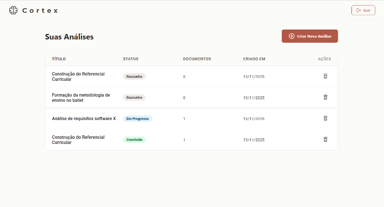
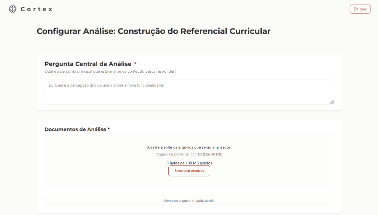
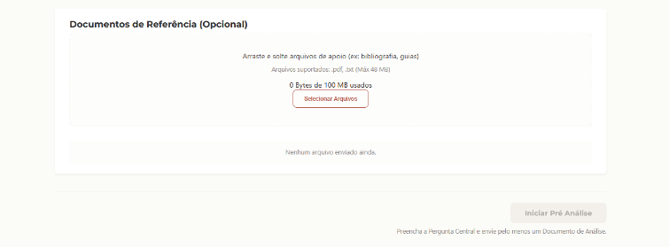
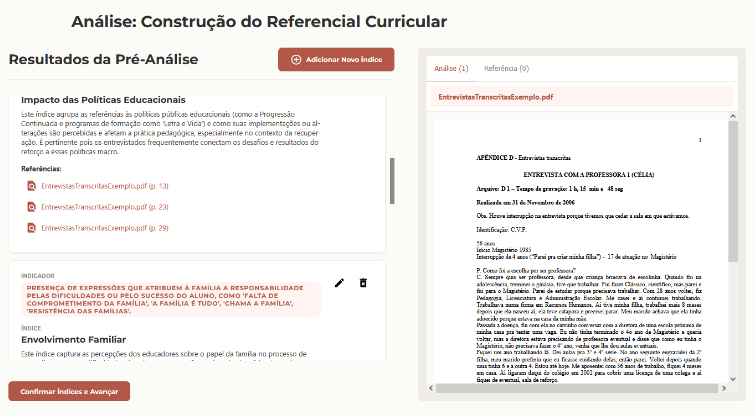
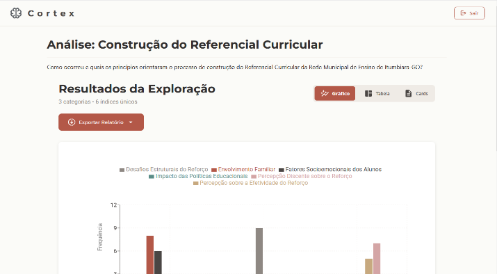
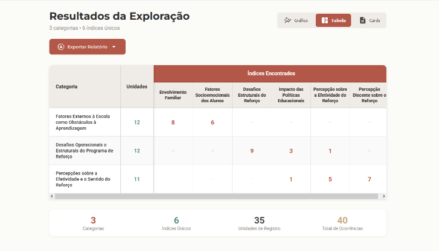
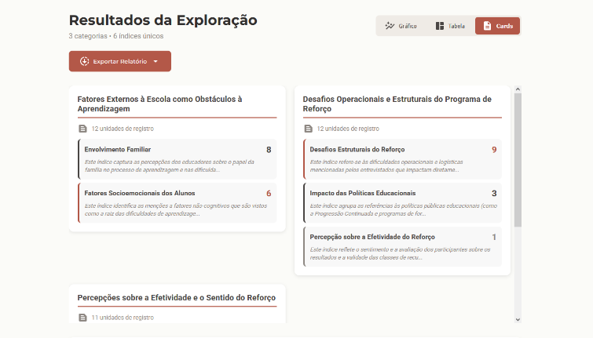

# Cortex

Uma ferramenta de apoio inteligente para a análise de conteúdo em pesquisas qualitativas.

## Sobre o Projeto

O Cortex é uma aplicação web construída com backend em C#/.NET, frontend em React, banco de dados PostgreSQL e integração com a nuvem, projetada para apoiar pesquisadores acadêmicos na condução de análises de conteúdo qualitativas fundamentadas na metodologia de Laurence Bardin. Diferente de softwares CAQDAS tradicionais (como ATLAS.ti e NVivo), o Cortex atua como um assistente metodológico. A ferramenta combina Processamento de Linguagem Natural e a arquitetura RAG (Retrieval-Augmented Generation) do Google Vertex AI para automatizar etapas operacionais exaustivas, preservando a autonomia interpretativa e o rigor científico do pesquisador.

# Principais funcionalidades

### Autenticação e isolamento de dados

O sistema conta com um fluxo completo de autenticação utilizando JSON Web Tokens (JWT), assegurando que cada pesquisador acesse e gerencie exclusivamente seus próprios projetos.

### Dashboard de análises
Listagem das análises em tabela, com título, status (Rascunho, Em Progresso, Concluído), quantidade de documentos e data de criação. Retomada de trabalho: é possível continuar exatamente de onde parou.

### Configuração (constituição do corpus)

Definição da pergunta central da análise, que orienta todo o processamento da IA. 
Upload de documentos de análise (o corpus, nesta versão focado em transcrições de entrevistas) em PDF e TXT, com validação automática de formato.
Upload opcional de documentos de referência (artigos, livros, teses), usados pelo mecanismo de RAG para fundamentar as sugestões da IA, mas não analisados como corpus.

### Pré-Análise (índices e indicadores)

Geração automática de índices e indicadores via Vertex AI / Gemini, com prompt estruturado a partir da pergunta central, dos documentos e dos critérios de Bardin.
Índices exibidos em cards, com indicador, nome, descrição e referências (trechos exatos dos documentos, com página).
Visualizador de PDF/TXT integrado, para conferir o contexto completo de cada referência.
Apropriação pelo pesquisador: editar índice, editar indicador, remover índice e adicionar índice manualmente.

### Exploração do Material (categorização)

O Gemini recebe os índices validados e aplica os critérios de contagem por frequência de Bardin, identificando unidades de registro e agrupando-as em categorias.
Resultados em três visualizações:
* Gráfico: barras com a distribuição de frequências por categoria.
* Tabela: matriz categorias × índices, com a frequência de co-ocorrência.
* Cards: categorias expansíveis, com definição, índices relacionados e todas as unidades de registro (texto completo, documento, página, justificativa e índices encontrados).
As categorias não são editáveis, pois são o resultado direto e sistemático da aplicação dos índices validados sobre o corpus.

### Exportação de relatório

Exportação em PDF com:

1. Título da análise e pergunta central
2. Informações gerais (data, totais de categorias, unidades e documentos)
3. Gráfico de distribuição
4. Tabela resumo (categorias × índices)
5. Detalhamento das categorias
6. Detalhamento dos índices por categoria (indicador e referências)
7. Lista completa de unidades de registro, com justificativas

O relatório preserva a rastreabilidade de todo o percurso, dos trechos originais do corpus até as categorias finais.

# Princípios de design

* IA como assistente, não substituta: o pesquisador mantém controle total sobre as decisões interpretativas.
* Rastreabilidade: toda sugestão da IA aponta para documento, página e trecho original.
* Rigor metodológico: o fluxo segue as fases de Bardin (2011), com progressão linear.

# Limitações do MVP

* Exportação apenas em PDF (DOCX e LaTeX estavam previstos nos requisitos).
* Foco em transcrições de entrevistas em PDF/TXT.
* Não implementa a terceira fase de Bardin (Tratamento dos Resultados, Inferência e Interpretação), deixada propositalmente a cargo do pesquisador.
* Implementação de um recurso de edição que mantenha um histórico de versões para conciliar a autonomia do pesquisador com a trilha de auditoria.

Desenvolvido como Trabalho de Conclusão de Curso (TCC) por Ana Júlia, fundamentado em:

BARDIN, Laurence. Análise de Conteúdo. São Paulo: Edições 70, 2011.

